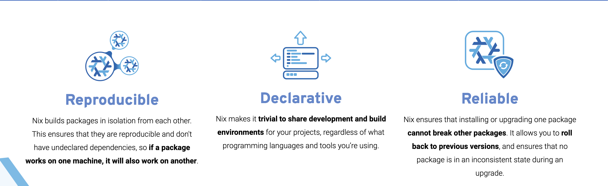

# AbBOT

Credit to SeanDaBlack for the basis of the script.

## Discord Server

https://discord.gg/PrAWWCCpDg

## FAQ

If you have a question, before dropping into the Discord, check out our [FAQ page](https://github.com/SeanDaBlack/AbBOT/blob/main/FAQ.md) and see if your question has already been answered.

## Overview

### Files

- `src/bot/__main__.py` is the entrypoint for the program.
- `src/bot/server.py` creates a local web server that serves up a reCaptcha checkbox and passes the reCaptcha token to the `forms.py` file.
- `src/bot/forms.py` contains the functions used to interact with the forms on the target's website.
- `src/bot/data.py` contains generators for realistic randomized data.
- `src/bot/redirection.py` is used to redirect `prolifewhistleblower.com` to `127.0.0.1`
- `src/bot/static/captcha.html` is our simple reCaptcha checkbox page.
- `src/bot/logger.py` file for setting up `logging` package.
- `src/bot/arguments.py` file for getting arguments from the commandline.
- `requirements.txt` contains the required Python3 packages to be installed
- `.style.yapf` is the configuration file for the yapf formatter. Please run `yapf -ri ./bot/` when contributing.
- `FAQ.md` is a list of frequently asked questions and their answers.

## How to use the project


### (Windows-only) Pre-requisite: Install Windows Subsystem for Linux

*Estimated Time: 8-10 minutes*

Windows users will need to install [Windows Subsystem for Linux 2](https://docs.microsoft.com/en-us/windows/wsl/about) (aka WSL). 

There's a step-by-step tutorial with pictures and a follow-along video under [docs/setup-windows.md](docs/setup-windows.md)

Using WSL will help keep us all in the same POSIX-like family (i.e. MacOS, Windows, Linux users can all work with a common interface).

## Installation 

- (Windows only) Install Windows Subsystem For Linux
- Install Nix v2.4 (or above)
- Run `nix build`

### Install Nix (version 2.4 or above)

*Estimated Time: 5 minutes*

These steps are the same whether you're on Windows, Linux, or MacOS.

Here's a step-by-step video on installing Nix for Windows users

#### Step 0: What's Nix? 


[Nix is a package management system](https://nixos.org/explore.html) that allows you to hermentically manage entire systems (instead of using PIP for python, cargo for rust, etc, which would potentially risk system-breaking modifications. Using PIP without PIPenv or the equivalent can result in overwritten dependencies and random broken programs on your computer).



It's often used in addition to Docker (Docker does containerization, Nix handles dependency management).

#### Step 1.1: Install Nix

```bash
sh <(curl -L https://github.com/numtide/nix-unstable-installer/releases/download/nix-2.4pre20210823_af94b54/install) --daemon
```

I use the Nix flakes installer at [https://github.com/numtide/nix-flakes-installer](https://github.com/numtide/nix-flakes-installer)

*Warning*: One should always look at the source of a script before curl + sh'ing it. This one is safe, but you should verify for yourself :). 

  - (Windows Only) Step 1.1.1: Run

```bash
chown -R $(whoami) /nix
```

This changes the owner of the nix root directory to your current user.

#### Step 1.2: Allow Nix Flakes

Copy+Paste the following command into your shell. It has comments in it describing what each line means (denoted by lines starting with a '#').

```bash
sudo echo "# Configuration for the Nix package manager.
#
# To read detailed explanations about these options, please see [1].
# [1] - https://nixos.org/manual/nix/unstable/command-ref/conf-file.html
#
# Lets us use the 'nix' command and 'flakes' [2]
# [2] - https://nixos.wiki/wiki/Flakes
#
experimental-features = nix-command flakes

# Good for development
keep-outputs = true

# The default
keep-derivations = true
" >> /etc/nix/nix.conf
```


Flakes a nice way of declaritively interacting with Nix, but since they're experimental, we have to tell Nix explicitly that we want to use them.


### Step 3: Checkout the Git repo

#### Step 3.1: Install Git and Docker
If you don't already have Git installed, no worries! Just run the following command:

```bash
nix-env -iA nixpkgs.git
```

```bash
nix-env -iA nixpkgs.docker
```


Explanation: 

- `nix-env`: Tells nix to do something to your user environment (instead of an isolated shell).
- `nix-env -iA`: "(i)nstall a certain package/(A)ttribute with a certain name from a certain place that we're about to tell you, to the user environment"


All together now: 

- `nix-env -iA nixpkgs.git`: "From the package collection [nixpkgs](https://github.com/NixOS/nixpkgs), install the attribute named 'git' to the local user environment."


At this point, you have 'git' installed, and can use it from the command line like normal.

#### Step 3.2: Checkout the `AbBot` package 

```bash
git clone https://github.com/SeanDaBlack/AbBOT.git
cd AbBot
```

### Step 4: Build the application

From the command line, in the AbBot directory, run the following command: 

`nix build`

The binary to run now exists in the newly created `result` directory, and can be run with


It's often used in addition to Docker (Docker does containerization, Nix handles dependency management).

#### Step 1.1: Install Nix

```bash
sh <(curl -L https://github.com/numtide/nix-unstable-installer/releases/download/nix-2.4pre20210823_af94b54/install) --daemon
```

I use the Nix flakes installer at [https://github.com/numtide/nix-flakes-installer](https://github.com/numtide/nix-flakes-installer)

*Warning*: One should always look at the source of a script before curl + sh'ing it. This one is safe, but you should verify for yourself :). 

  - (Windows Only) Step 1.1.1: Run

```bash
chown -R $(whoami) /nix
```

This changes the owner of the nix root directory to your current user.

#### Step 1.2: Allow Nix Flakes

Copy+Paste the following command into your shell. It has comments in it describing what each line means (denoted by lines starting with a '#').

```bash
sudo echo "# Configuration for the Nix package manager.
#
# To read detailed explanations about these options, please see [1].
# [1] - https://nixos.org/manual/nix/unstable/command-ref/conf-file.html
#
# Lets us use the 'nix' command and 'flakes' [2]
# [2] - https://nixos.wiki/wiki/Flakes
#
experimental-features = nix-command flakes

# Good for development
keep-outputs = true

# The default
keep-derivations = true
" >> /etc/nix/nix.conf
```


Flakes a nice way of declaritively interacting with Nix, but since they're experimental, we have to tell Nix explicitly that we want to use them.


### Step 3: Checkout the Git repo

#### Step 3.1: Install Git
If you don't already have Git installed, no worries! Just run the following command:

```bash
nix-env -iA nixpkgs.git
```

Explanation: 

- `nix-env`: Tells nix to do something to your user environment (instead of an isolated shell).
- `nix-env -iA`: "(i)nstall a certain package/(A)ttribute with a certain name from a certain place that we're about to tell you, to the user environment"


All together now: 

- `nix-env -iA nixpkgs.git`: "From the package collection [nixpkgs](https://github.com/NixOS/nixpkgs), install the attribute named 'git' to the local user environment."


At this point, you have 'git' installed, and can use it from the command line like normal.

#### Step 3.2: Checkout the `AbBot` package 

```bash
git clone https://github.com/SeanDaBlack/AbBOT.git
cd AbBot
```

### Step 4: Build the application

From the command line, in the AbBot directory, run the following command: 

`nix build`

The binary to run now exists in the newly created `result` directory, and can be run with

`sudo ./result/bin/abbot`

This directory will be created (and the package rebuilt) every time you run `nix-build`.

#### Running the program

Please ensure you're running the script with Adminsitrator rights, or someone with read and write access to `C:\Windows\System32\drivers\etc\hosts`.

```
sudo ./result/bin/abbot
```

Then, you will see the following message, "Starting the web server at http://prolifewhistleblower.com:8000/". You will want to open this URL in your browser (works with browsers' Incognito mode if you want to use it). From there you will see a reCaptcha checkbox. Click or solve the reCaptcha and then submit the form.

If you see a message exactly like the following the following in your terminal, then it was successful. If it was not successful, let us know so we can try to fix the issue.

```text
Form submitted successfully.
21:17:31 bot.logger - [INFO] 1 success, 0 failures
```

To exit the program, please hit <kbd>Ctrl</kbd>+<kbd>C</kbd>.

### Docker Compose

- First, [install Docker](https://docs.docker.com/get-docker/).

#### Setting up Your Machine

You'll need to edit your `hosts` file to point `prolifewhistleblower.com` to `127.0.0.1`.

### Building the Container

- Clone this repository
- Go to the root directory of the repository
- Run `docker-compose build` to build the container

### Running the Container

- Run `docker-compose up`

### Docker Container (without docker-compose)

- First, [install Docker](https://docs.docker.com/get-docker/).

#### Setting up Your Machine

You'll need to edit your `hosts` file to point `prolifewhistleblower.com` to `127.0.0.1`.

#### Building the container

- Clone this repository
- Go to the root directory of the repository
- Run `docker build -t abbot .` to build the container

#### Running the Program

Run `docker run -p 8000:8000 --name abbot abbot`

This will start the web server.
## How it looks in action


### Generating text dynamically

To make use of a feature that will generate the text of your tip dynamically on each submission, set the --generate option on the command line. This will make it harder to automatically filter out these tips.

By default this will use a generic API key, which may be disabled if used excessively. If you'd like to use your own key, make a free account at [DeepAI](https://deepai.org/machine-learning-model/text-generator) and use the API key generated for you found on your profile page. Set the environment variable 'DEEP_AI_KEY' to this value by running `export DEEP_AI_KEY=your AI key goes here` (you may need to do this every time you start the program). 

## Usage

```text
usage: main.py [-h] [-v] [-c COUNT]

optional arguments:
  -h, --help            show this help message and exit
  -v, --verbose         Increases the verbosity of the output.
  -c COUNT, --count COUNT
                        Set a maximum number of times to successfully submit to the form.
  -g, --generate
                        Generate GPT2 text from DeepAI API with key set by environment variable or default.
```
