# Getting started for Windows Users 

This guide is meant for those who have little coding experience, so please don't feel intimidated! 


We're going to do two things:

1. Install [Windows Subsystem for Linux 2](https://docs.microsoft.com/en-us/windows/wsl/install-win10)

- This lets you use all the same commands as us MacOS and Linux folks, which will make troubleshooting and mutual aid much easier.

- Here's a step-by-step video on installing WSL you can follow along with: 


[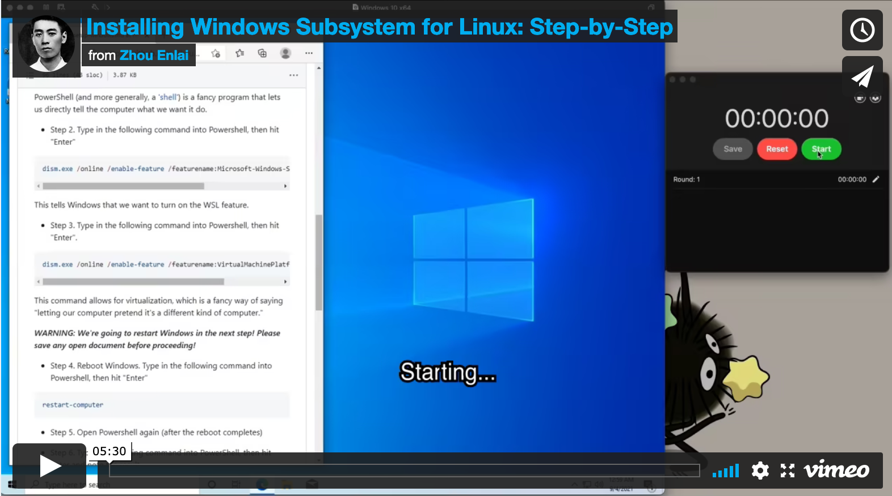](https://vimeo.com/597950782)


2. Install [Nix (the package manager)](https://nixos.org/)

- This lets us all have identical, reproducible software builds-- even better for mutual aid.

- Here's a step-by-step video on installing Nix you can follow along with: 


## 1. Install Windows Subsystem for Linux
 
Windows Subsystem for Linux (WSL) basically lets Windows pretend it's Linux, so you can type all the same commands as us Linux users (and get the same results). It's really neat, just takes a few minutes to set up. Here, I've reproduced and condensed the official WSL installation steps [found here](https://docs.microsoft.com/en-us/windows/wsl/install-win10). Feel free to refer to the original document if you run into trouble.


- Step 1. Click on the Search bar in the bottom left corner of Windows, then type the word "Powershell" and hit enter.

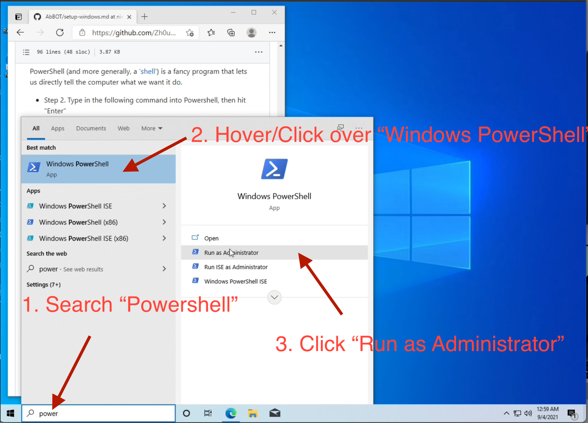


PowerShell (and more generally, a ['shell'](https://en.wikipedia.org/wiki/Shell_(computing))) is a fancy program that lets us directly tell the computer what we want it do. 


- Step 2. Type in the following command into Powershell, then hit "Enter"

```PowerShell
dism.exe /online /enable-feature /featurename:Microsoft-Windows-Subsystem-Linux /all /norestart
```

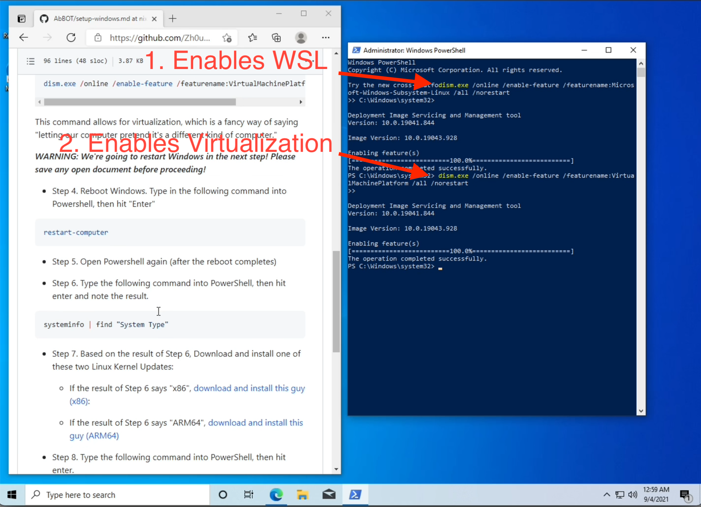

This tells Windows that we want to turn on the WSL feature.


- Step 3. Type in the following command into Powershell, then hit "Enter".


```PowerShell
dism.exe /online /enable-feature /featurename:VirtualMachinePlatform /all /norestart
```


This command allows for virtualization, which is a fancy way of saying "letting our computer pretend it's a different kind of computer."

***WARNING: We're going to restart Windows in the next step! Please save any open document before proceeding!***

- Step 4. Reboot Windows. Type in the following command into Powershell, then hit "Enter" 

```PowerShell
restart-computer
```


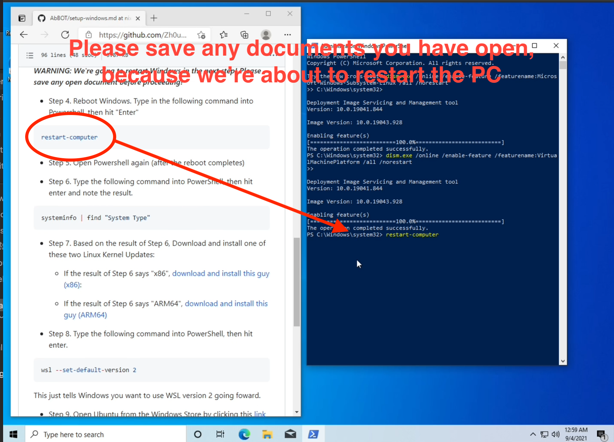

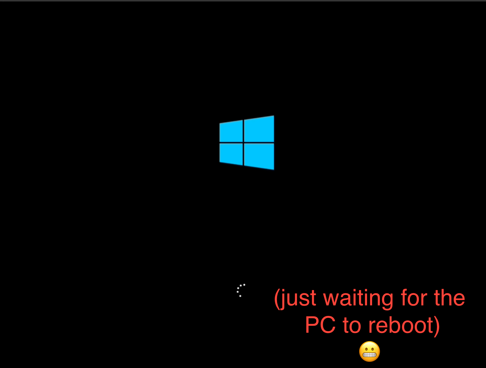
 
- Step 5. Open Powershell again (after the reboot completes)


- Step 6. Type the following command into PowerShell, then hit enter and note the result.

```PowerShell
systeminfo | find "System Type"
```


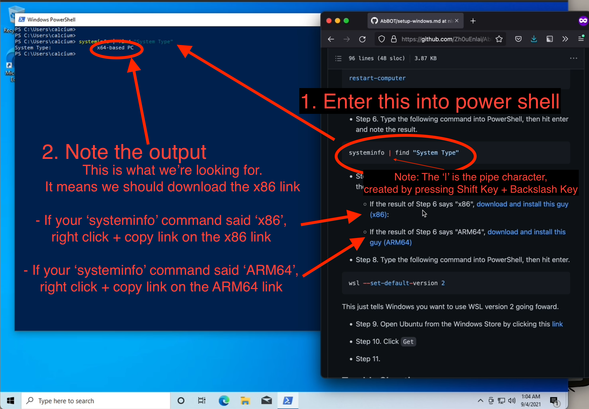


- Step 7. Based on the result of Step 6, Download and install one of these two Linux Kernel Updates:


    - If the result of Step 6 says "x86", [download and install this guy (x86)](https://wslstorestorage.blob.core.windows.net/wslblob/wsl_update_x64.msi): 

    - If the result of Step 6 says "ARM64", [download and install this guy (ARM64)](https://wslstorestorage.blob.core.windows.net/wslblob/wsl_update_arm64.msi)


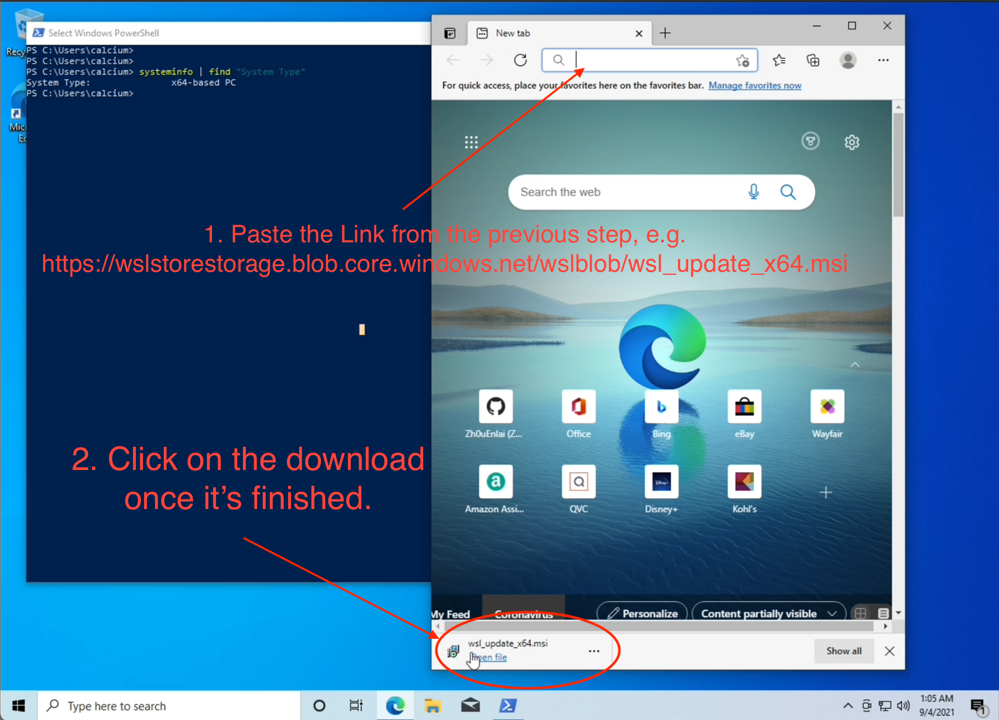


- Step 8. Type the following command into PowerShell, then hit enter.

```PowerShell
wsl --set-default-version 2
```

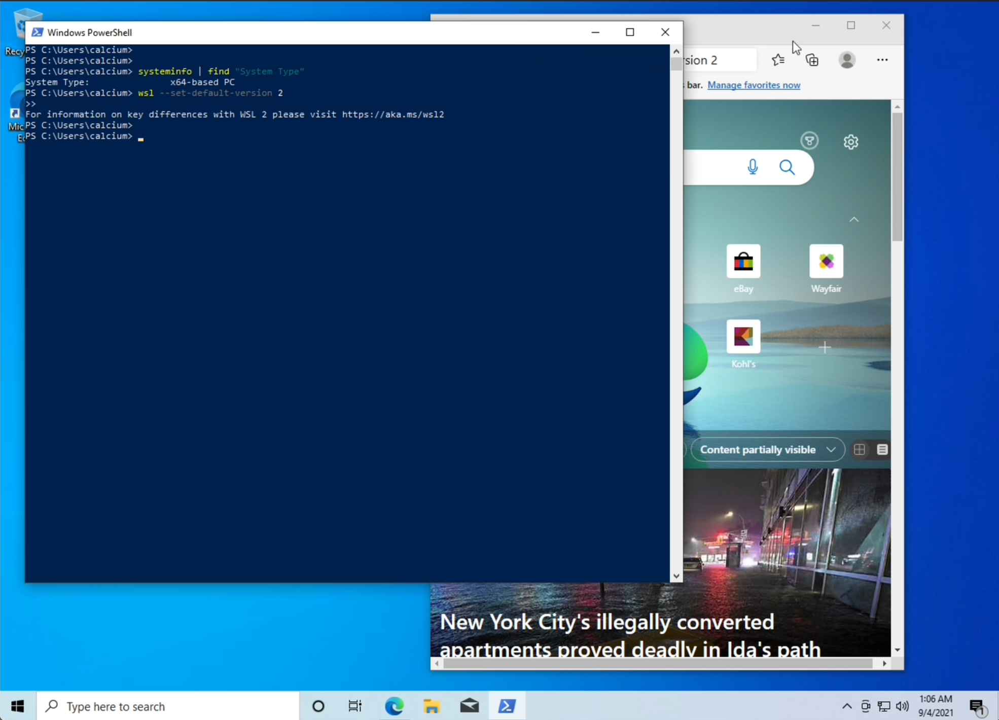

This just tells Windows you want to use WSL version 2 going foward.

- Step 9. Open Ubuntu from the Windows Store by clicking this [link](https://www.microsoft.com/en-us/p/ubuntu-1804-lts/9n9tngvndl3q?rtc=1#activetab=pivot:overviewtab)


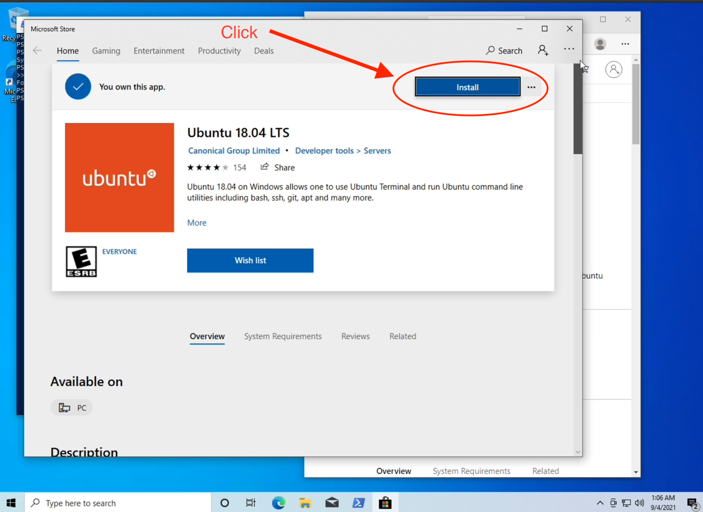


- Step 10. Click `Install` and wait for the installation to finish.

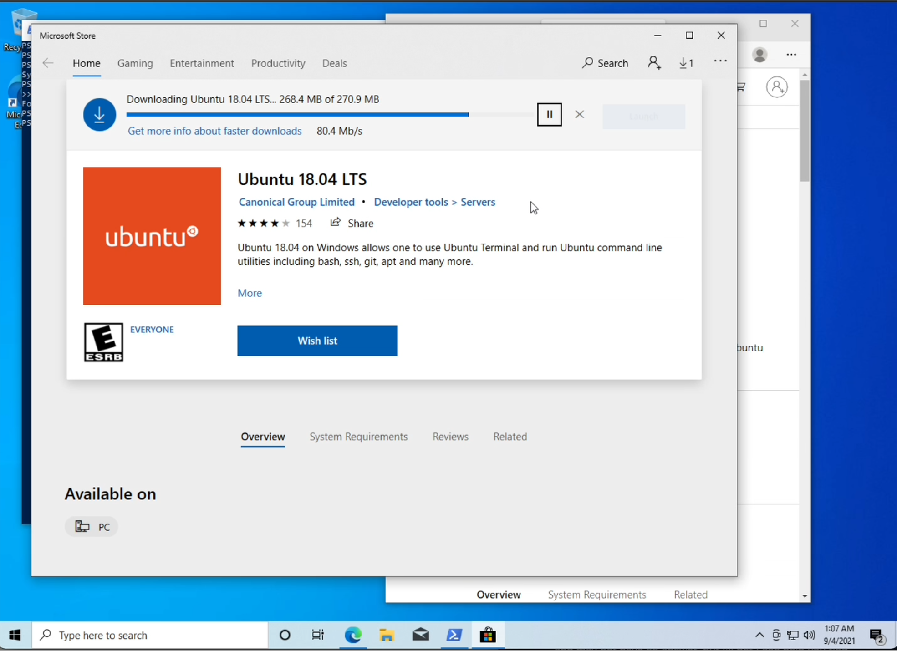


- Step 11. After the installation finishes, click `Launch`

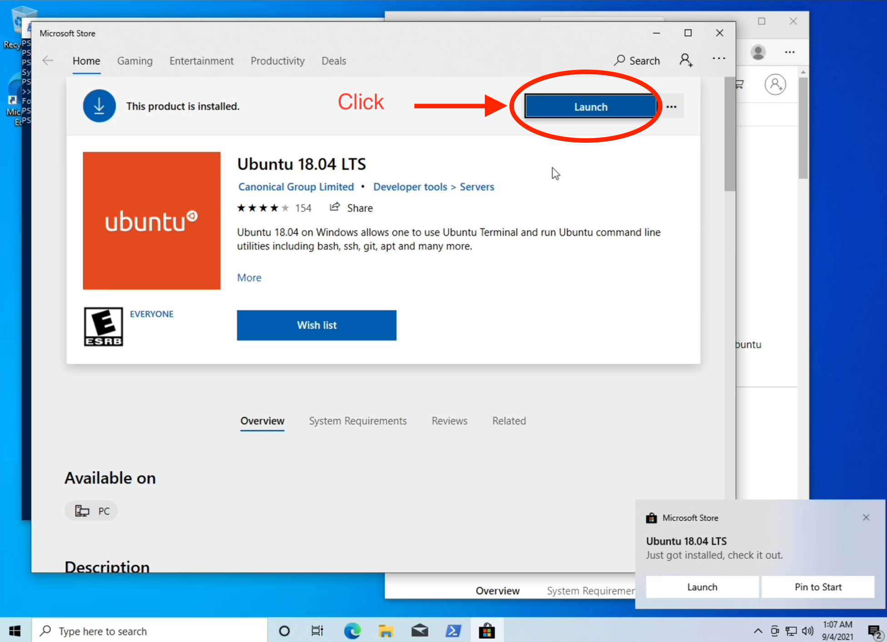

- Step 12. Wait for the setup to complete (launching Ubuntu is only slow the first time, only takes a few milliseconds next time)

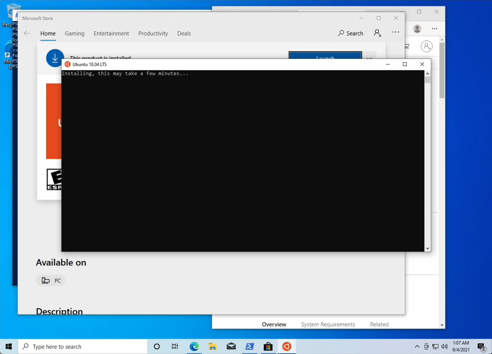


- Step 12. Enter a username and password


- Step 13. **Celebrate! You finished!**

## 2. Install Nix

Here's step-by-step video for installing Nix on Windows. The steps are mostly the same as in the Install Nix section of the project [README](../README.md).

[](https://vimeo.com/597899648)


## Trouble Shooting

- First, check out the official [Windows Subsystem for Linux Installation Guide for Windows 10 guide](https://docs.microsoft.com/en-us/windows/wsl/install-win10) and see if it has your answer there.

- Still having trouble? Jump on the Discord and look for `Zhou.Enlai`, or email me at [zh0u(dott)enlai(at)pm.me](mailto:zh0u(dott)enlai@pm.me?subject=Pls%20Help%3A%20Troubleshooting%20Nix%20Install%20for%20Windows) (replacing the "dott" and "at" with the proper email characters), using the subject `Pls Help: Installing Nix for Windows`. Admittedly, I'm not a Windows user, and may not have an answer, but I'll bet I can help you find somewhere to look! 

    - I'm pretty friendly so please don't feel intimidated-- I was new too once, and there are no stupid questions!

- Feel free to add to this section if you run into issues and find a solution!